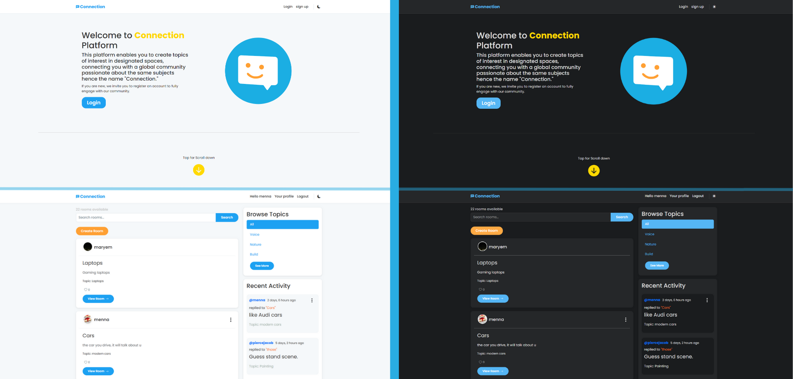

# Connect - A Django Web Application

**Visit the live app: [mennaallah.pythonanywhere.com](https://mennaallah.pythonanywhere.com)**

This document provides a complete overview of the Connect project, its structure, features, and the key backend and frontend development concepts used in its creation.

## 1. Project Overview

Connect is a web application designed for creating and joining topic-based study groups. Users can browse rooms categorized by topics, participate in discussions by posting messages, manage their own rooms, like rooms and messages, and explore user profiles. The project is built using the Django web framework for the backend, styled with Bootstrap 5, Bootstrap Icons, and custom CSS for a modern, responsive frontend, and incorporates modular template components for maintainability.

## 2. Features

- **User Authentication**: Full user management with registration, login, logout, and profile pages showing hosted rooms, recent activity, and liked content.
- **Room & Message CRUD**: Authenticated users can create, read, update, and delete rooms and messages, with permission checks ensuring only owners can edit or delete their content.
- **Topic Browsing & Filtering**: Rooms are organized by topics, with a sidebar for filtering rooms by topic or viewing all rooms. Topics list now includes a "See More/See Less" toggle for additional topics when more than five exist.
- **Live Search**: A dynamic search bar filters rooms by topic, name, or description using Django’s `Q` objects for flexible querying.
- **User Profiles**: Each user has a profile page displaying their username, hosted rooms, recent messages, liked rooms and messages, join date, first room, and first message. Profiles include forms for updating username, password, and profile photo, with a tabbed interface for Rooms, Liked Content, and Recent Activity.
- **Likes for Rooms and Messages**: Authenticated users can like/unlike rooms and messages, with like counts displayed and updated instantly via AJAX. 
- **Blur Effect for Non-Authenticated Users**: Non-logged-in users see a blur overlay and login/signup prompt when scrolling past 1400px on the homepage, encouraging account creation.
- **Reusable Components**: Modular template components (`feed_component.html`, `topics_component.html`, `activity_component.html`) ensure a clean, reusable frontend.
- **Responsive Design**: Built with Bootstrap 5 and custom CSS, the application is fully responsive, adapting to mobile, tablet, and desktop screens with tailored media queries for enhanced mobile usability.
- **Dark Theme Support**: A toggleable dark/light mode with a sun/moon icon in the navbar, storing user preference in `localStorage` and applying theme-specific styles for all elements, including navbar, cards, forms, and buttons.
- **Dynamic Navbar**: The navbar hides when scrolling down and reappears when scrolling up, improving user experience on long pages.
- **Password Visibility Toggle**: Password fields in login, registration, and password change forms include an eye icon to toggle visibility, enhancing user experience.
- **Styling**: A modern, social media-inspired theme (inspired by Twitter/X) with custom colors (`#1DA1F2` for primary, `#FFD700` for highlights, `#E0245E` for likes), hover effects, a Lottie animation on the homepage for unauthenticated users, and a bouncing arrow animation to encourage scrolling.
- **Custom Template Tags**: Smart components (`topics_list`, `recent_activity`) fetch their own data, enhancing modularity and reducing view complexity.
- **Pagination for Activities**: The "All Activities" page includes pagination, displaying 10 messages per page with navigation controls.
- **Profile Photo Support**: Users can upload, update, or clear profile photos, displayed in room cards and profile pages, with a default SVG icon if no photo is set.
- **Enhanced Topic Selection**: Room creation/editing forms allow selecting existing topics or creating new ones, with JavaScript to disable one field when the other is used.
- **Activity Section Height Matching**: The Recent Activity section dynamically matches the height of the Rooms section (95% to account for padding/margins) without scrolling, improving layout consistency.
- **Improved Accessibility**: Links for unauthenticated users redirect to the login page with a `next` parameter to preserve the intended destination after login.

## 3. Project Structure (Multi-App Architecture)

The project follows a modular, multi-app architecture to ensure scalability and maintainability, with clear separation of concerns between user management and core functionality.

- **`connection/` (Project Folder)**: Main project configuration directory.
  - `settings.py`: Configures project-wide settings, including `INSTALLED_APPS` (`users`, `activities`, `widget_tweaks`), SQLite database, static file settings (`STATIC_URL`, `STATICFILES_DIRS`, `STATIC_ROOT`), media file settings (`MEDIA_URL`, `MEDIA_ROOT`), and custom template tags.
  - `urls.py`: Main URL router, delegating to app-specific `urls.py` files using `include()` and serving static and media files in development.
  - `templates/main.html`: Base template with Bootstrap 5, Bootstrap Icons, Google Fonts (Inter, Poppins), custom CSS, a responsive navbar with dynamic hide/show on scroll, a Lottie animation for unauthenticated users, a blur effect at 1400px scroll, JavaScript for likes, theme toggling, and password visibility toggling.
  - `static/css/style.css`: Custom CSS with a social media-inspired theme, including responsive media queries, animations (e.g., bouncing arrow), dark theme styles (e.g., `#252729` for backgrounds, `#55B6F5` for primary in dark mode), and styles for likes, blur effects, and profile photos.
  - `static/js/likes.js`: JavaScript for handling AJAX like/unlike actions with CSRF token support.
  - `static/js/theme.js`: JavaScript for dark/light theme toggling, navbar scroll behavior, and matching Recent Activity section height to Rooms section.

- **`activities/` (App)**: Handles core functionality related to study rooms, topics, messages, and likes.
  - `models.py`: Defines `Topic` (unique names), `Room` (host, topic, participants, timestamps), `Message` (user, room, body), `RoomLike` (user, room, timestamp), and `MessageLike` (user, message, timestamp) models with appropriate relationships and `unique_together` constraints for likes. 
  - `views.py`: Manages room/message CRUD, search, related room suggestions, AJAX views for liking/unliking rooms and messages, and paginated all activities view, with `login_required` decorators for protected views.
  - `urls.py`: Defines routes for homepage, room view, room creation/update/deletion, message deletion, like/unlike actions (`like-room/<int:pk>`, `like-message/<int:pk>`), and all activities (`all-activities/`).
  - `forms.py`: `RoomForm` for creating/editing rooms, with custom validation for selecting or creating topics and JavaScript to toggle field availability.
  - `templatetags/activity_tags.py`: Custom tags (`topics_list`, `recent_activity`, `model_name`) for rendering topic lists and recent activity.
  - Templates:
    - `home.html`: Displays search bar, room count, create room button, and components for rooms, topics, and activity, with Lottie animation script.
    - `room.html`: Shows room details, messages, participants, related rooms with highlighted topic, and like buttons for rooms and messages.
    - `room_form.html`: Form for creating/editing rooms with `widget_tweaks` for styling and JavaScript for topic field toggling.
    - `delete.html`: Confirmation page for deleting rooms or messages.
    - `all_activities.html`: Displays paginated list of all messages with activity component styling.
    - Components: `feed_component.html` (room cards with host profile photos and like buttons), `topics_component.html` (topic list with "See More/See Less" toggle), `activity_component.html` (recent messages with delete option for own messages). 

- **`users/` (App)**: Manages user-related functionality.
  - `models.py`: Defines `UserProfile` with a one-to-one link to `User` and a profile photo field supporting image uploads.
  - `views.py`: Handles registration, login, logout, and user profile display, including hosted rooms, messages, liked content, and forms for updating username, password, and profile photo.
  - `urls.py`: Defines routes under the `users/` namespace (e.g., `/accounts/login/`, `/accounts/profile/<username>/`).
  - `forms.py`: Custom forms for user registration (`UserCreationForm`), profile photo upload (`UserProfileForm`), username changes (`UsernameChangeForm`), and password updates (`CustomPasswordChangeForm`) with lowercase username validation and password validation checks.
  - Templates:
    - `login_register.html`: Unified form for login and registration, styled with `widget_tweaks`, with password visibility toggle.
    - `profile.html`: Displays user details, profile photo, hosted rooms, messages, liked content, join date, first room, and first message, with tabbed interface (Rooms, Liked Content, Recent Activity) and forms for authenticated users to update profile information.

## 4. Setup and Installation

To run the project locally:

1. **Create a Virtual Environment**:
   ```bash
   python -m venv venv
   .\venv\Scripts\activate  # On Windows
   source venv/bin/activate  # On macOS/Linux
   ```

2. **Install Dependencies**:
   ```bash
   pip install django django-widget-tweaks pillow
   ```

3. **Configure Static and Media Files**:
   - Ensure `settings.py` includes:
     ```python
     STATIC_URL = '/static/'
     STATICFILES_DIRS = [BASE_DIR / "static"]
     STATIC_ROOT = BASE_DIR / "staticfiles"
     MEDIA_URL = '/media/'
     MEDIA_ROOT = BASE_DIR / 'media'
     ```
   - Create `static/css/`, `static/js/`, and `media/profile_photos/` directories for `style.css`, `likes.js`, `theme.js`, and profile photo uploads.
   - Run:
     ```bash
     python manage.py collectstatic
     ```

4. **Apply Database Migrations**:
   ```bash
   python manage.py makemigrations
   python manage.py migrate
   ```

5. **Create a Superuser**:
   ```bash
   python manage.py createsuperuser
   ```

6. **Run the Development Server**:
   ```bash
   python manage.py runserver
   ```
   Access the project at `http://127.0.0.1:8000/`.

7. **Optional: Lottie Animation and Bootstrap Icons**:
   - Ensure the following are included in `main.html`:
     ```html
     <script src="https://unpkg.com/lottie-web@latest/build/player/lottie.min.js"></script>
     <link href="https://cdn.jsdelivr.net/npm/bootstrap-icons@1.10.5/font/bootstrap-icons.css" rel="stylesheet">
     ```
   - Place animation files (e.g., `wink.json`) in `static/animations/`.

## 5. Key Backend and Frontend Concepts

The project emphasizes modern Django best practices and frontend design principles.

### a. URL Routing and Namespacing
- **Main Router (`connection/urls.py`)**: Uses `include()` to delegate routing to `users` and `activities` apps, with `static()` for serving static and media files in development.
- **App Routers**: `users/urls.py` (with `app_name = 'users'`) and `activities/urls.py` define app-specific routes, using namespacing for collision-free URLs (e.g., ``).
- **Dynamic URLs**: Routes like `/room/<int:pk>/`, `/accounts/profile/<str:username>/`, `/like-room/<int:pk>/`, and `/like-message/<int:pk>/` use path converters for flexibility.

### b. Database Relationships & Lookups
- **ForeignKey**: Links `Message` to `Room`, `Room` to `Topic` and `User` (host), `RoomLike`/`MessageLike` to `User` and `Room`/`Message`, and `UserProfile` to `User`. `on_delete=models.SET_NULL` or `CASCADE` ensures data integrity.
- **ManyToManyField**: `Room.participants` allows multiple users to join rooms, with `related_name='participants'` for reverse lookups.
- **Reverse Lookups**: Access messages (`room.message_set.all()`), participants (`room.participants.all()`), user-hosted rooms (`user.room_set.all()`), user messages (`user.message_set.all()`), and likes (`room.likes.count()`, `user.roomlike_set.all()`, `user.messagelike_set.all()`).
- **Unique Constraints**: `unique_together` in `RoomLike` and `MessageLike` prevents duplicate likes by the same user. 

### c. Django Forms & Validation
- **GET vs. POST**: Views like `createRoom`, `loginPage`, `like_room`, `like_message`, and `userProfile` handle `GET` for display and `POST` for submission (including AJAX POST for likes). 
- **form.is_valid()**: Ensures input validation and security (e.g., CSRF protection).
- **commit=False**: Used in `createRoom`, `registerPage`, and `userProfile` to modify objects (e.g., set `room.host`, lowercase `user.username`, or handle profile photo uploads) before saving.
- **Custom Validation**: `RoomForm.clean()` enforces exclusive topic selection, `UsernameChangeForm` validates unique usernames, and `CustomPasswordChangeForm` checks for unchanged passwords.

### d. Template Inheritance and Components
- **Inheritance**: All templates extend `main.html`, which includes Bootstrap 5, Bootstrap Icons, Google Fonts (Inter, Poppins), custom CSS, a dynamic navbar, a Lottie animation, a blur effect, and JavaScript for likes, theme toggling, and password visibility.
- **Components**: `feed_component.html` (room cards with profile photos and like buttons), `topics_component.html` (topic list with toggle), and `activity_component.html` (recent messages with delete option) are reusable via ``. 
- **Custom Inclusion Tags**: `topics_list` and `recent_activity` fetch their own data, keeping views lightweight.
- **Widget Tweaks**: Used in forms (`login_register.html`, `room_form.html`, `profile.html`) to apply Bootstrap classes (e.g., `form-control`, `form-select`) and style error messages.

### e. Styling and Frontend Design
- **Bootstrap 5 & Icons**: Provides a responsive grid, cards, forms, buttons, nav-tabs, and heart icons for likes, ensuring cross-device compatibility. 
- **Custom CSS (`style.css`)**:
  - Uses Poppins and Inter fonts and a Twitter/X-inspired color scheme (`#1DA1F2` for primary, `#FFD700` for highlights, `#E0245E` for liked state in light mode; `#55B6F5` for primary, `#252729` for backgrounds in dark mode).
  - Defines styles for cards (`.room-card`, `.card`), messages (`.message`), lists (`.list-group-item`), like buttons (`.like-btn`, `.liked`), blur effects (`.blur-overlay`, `.blur-prompt`), profile photos (`.profile-photo`), and tabs (`.nav-tabs`).
  - Includes hover effects (e.g., `room-card:hover` translates upward), a bouncing arrow animation (`.animated-arrow`), and dark theme styles for all elements.
  - Responsive design with media queries for mobile (`@media (max-width: 768px)`), smaller screens (`@media (max-width: 576px)`), and desktop (`@media (min-width: 769px)`).
- **Lottie Animation**: A wink animation (`wink.json`) on the homepage for unauthenticated users, with a blur effect triggered at 1400px scroll.
- **Form Styling**: `widget_tweaks` applies Bootstrap classes to form fields, with error messages styled in red (`.errorlist`) and password visibility toggling via eye icons.
- **Dynamic Navbar**: CSS transitions (`.navbar.dynamic-navbar`) hide the navbar on scroll down and show it on scroll up.
- **Tabbed Interface**: Bootstrap `nav-tabs` in `profile.html` for switching between Rooms, Liked Content, and Recent Activity.

### f. Security and Permissions
- **Authentication**: Uses Django’s built-in auth system with `UserCreationForm` and custom lowercase username handling.
- **Permission Checks**: `login_required` decorators and `PermissionDenied` exceptions ensure only authorized users can perform CRUD operations or like content. 
- **CSRF Protection**: All forms and AJAX requests include CSRF tokens for security (e.g., `getCookie('csrftoken')` in `likes.js`). 
- **Search Safety**: Uses `Q` objects for safe, flexible search queries without SQL injection risks.
- **Profile Security**: Username and password change forms validate for uniqueness and unchanged values, preventing errors.

### g. AJAX for Dynamic Interactions
- **Likes Feature**: Uses AJAX (`fetch` API in `likes.js`) to toggle likes on rooms and messages without page reloads, returning JSON responses with like status and counts. 
- **CSRF Handling**: JavaScript retrieves CSRF tokens from cookies for secure POST requests. 

## 6. Future Improvements
- **Custom Error Pages**: Implement `handler403` for `PermissionDenied` exceptions with a custom 403 template.
- **Production Settings**: Move `SECRET_KEY` to environment variables, set `DEBUG = False`, and configure `ALLOWED_HOSTS`.
- **Real-Time Features**: Integrate Django Channels for live messaging or notifications.
- **Testing**: Add unit tests for views, forms, and models using Django’s `TestCase`.
- **Enhanced Search**: Implement autocomplete or suggestions in the search bar.
- **Profile Enhancements**: Add bio or additional user details to `UserProfile`.

## 7. Share the App
- Shared the live app at **https://mennaallah.pythonanywhere.com**.
- Noted that the first load may be slow due to the free tier’s app sleep behavior.

This deployment process ensures the application runs on PythonAnywhere’s free tier, with all features (user authentication, room/message CRUD, likes, profiles, and responsive design) fully functional.